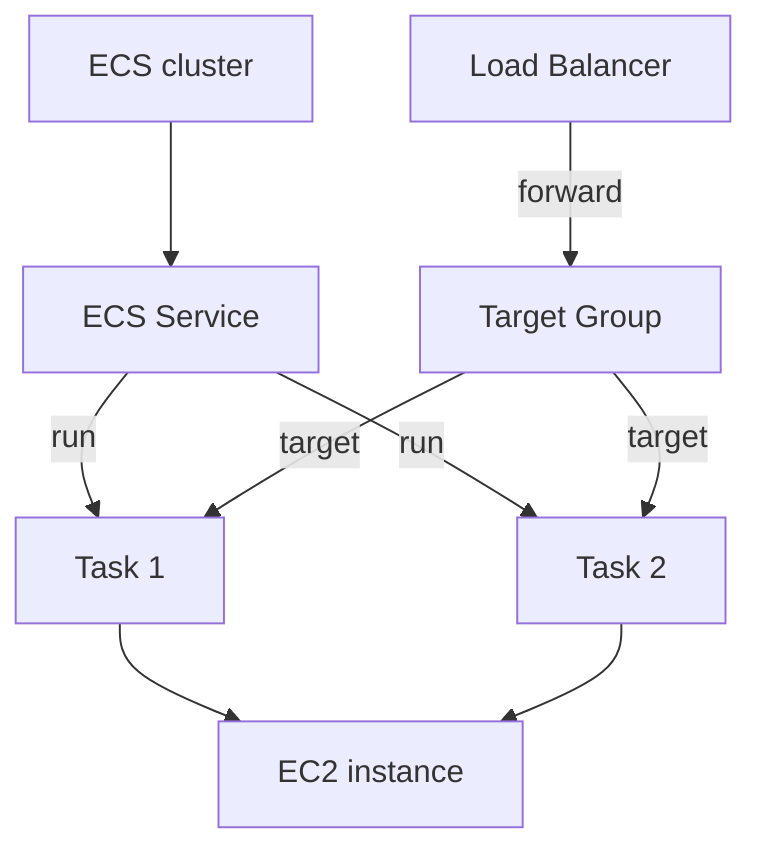
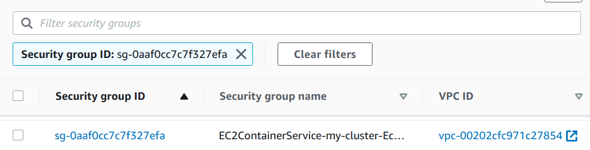
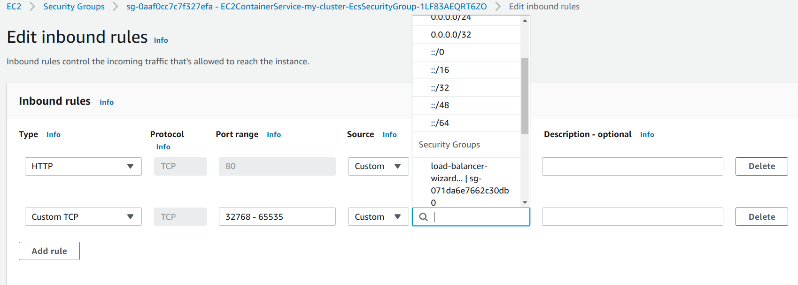
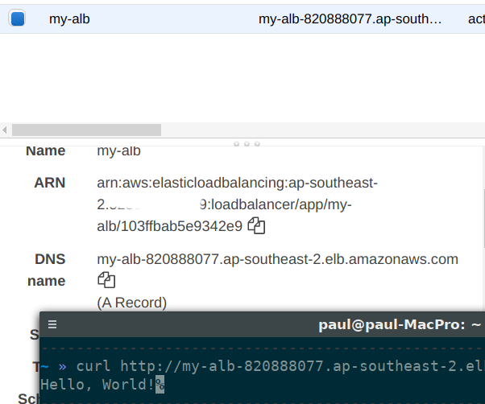

# Overview
This blog aims for developers to run containers on ECS. This will only cover the basics such as create an ECS cluster, create ECS service, Load Balancer, Target group.

Advanced topics such as Capacity Provider, Service discovery will not be covered.

# Prerequisite
Well, you need an AWS account :D

# What are we going to create?
- An ECS cluster with EC2 run time
- Some container tasks
- Load balancer
- Target group
## Diagram


# Let's get started
## The tools
To keep this simple for developers, no tool is used in this blog. However, I would recommend using Infrastructure as Code tools such as Terraform or CloudFormation.


##Steps
###1. Create your cluster
Go to [AWS ECS](console.aws.amazon.com/ecs/), then select `Create cluster`, You will see several options. In this blog we will be using `EC2 Linux + Networking`. This is the cheapest option available at the time of writing.

Here is the configuration list, I will explain some important configs.
```
Cluster name: my_cluster
Provisioning Model: On-Demand instance
EC2 instance type: t2.micro
Number of instances: 1
EC2 Ami Id: Leave as default
EBS storage: Leave as default
Key pair: None - Leave as default
Networking: Leave all as default
Container instance IAM Role: Create new role
CloudWatch Container Insights: untick
```

In `Cluster name`, just use any name you would like. I will be using `my-cluster`.

In Instance configuration. For `Provisioning model`. To keep it simple, we will be using `On-Demand Instance`.
> Spot instances will reduce the price by a lot. However, you need to understand Spot Fleet concept, which is not in the scope of this article. 

For `Instance type`, if you have free tier available, just use `t2.micro`. If your free tier is no longer available, click on *Manually enter desired instance type* and type `t3a.micro`
> This will be the instance that run our docker containers. We can run EC2 with ECS AMI image, and change user-data to join the instance into cluster.

###2. Create task definition
Cool, now that we have an ECS cluster, let's run some tasks on it. We will use the simple container `punkupoz/go-hello-world` I have built in previous [post](https://shipcapt.com/kube-gke-terraform/#prepare-the-image)

To run a task, you will need `task-definitions`. On the navigation bar on the left, select `Task definitions`, then 
`Create new Task Definition`. Select EC2 for type.

Here is, again, a list of configurations.
```
Task definition name: my-task
Task Role: None
Network Mode: <default>
Task execution IAM Role: ecsTaskExecutionRole
Task memory: (define yours)
Task CPU: (define yours)
```

- `Task role` is *What your container can do to AWS services*. This will require understanding of `IAM`.
- `Task execution IAM Role` is *What ECS actions can the ECS cluster do*, such as reading secret, storing application logs in cloudwatch, pulling containers. Again, just use `ecsTaskExecutionRole` or `Create new`
- `Network mode`, just use bridge, you don't need to know about this.
- `Task memory` and `Task CPU` are the hard limits for your task.

Next, click on `Add container`.

Configurations
```
Container name: hello
Image: punkupoz/go-hello-world:latest
Memory Limits: (define yours)
Port mapping:
  Host port: leave blank - for dynamic port
  Container port: 8080
All others: Keep default
```

For `image`, as I said, I will use the simple container image. This is where you put your application.

> I would use ECR for private containers

All others: Keep default

Click on `Create task`, we will have our first `task-definitions`

###3. Create a load balancer
Now, It would be better to prepare this before we create our ECS service. Load Balancer is located in [EC2](https://console.aws.amazon.com/ec2).

- On the Navbar, select `Load Balancers`, click `Create Load Balancer`.
- Choose Application Load Balancer here.
- `Name`: my-alb
- `Scheme`: internet-facing
- `IP Address Type`: ipv4
- `Listeners`: Use 80 for HTTP. If you have a domain name, you can request an SSL certificate from ACM, and add another listener for HTTPS.
- `Availability Zones -> VPC`: chose the vpc you have just created (Not the default) and tick all the boxes.
- Click `Next` till step 3
- Create a new security group, open port `80` to `0.0.0.0/0`, then next
- In configure routing, this is not important, just use a random name (REMEMBER THIS NAME, let's call it `Paul`), then next
- In step 4, do not add any instance, then click review.
- Click Create Load balancer

Now we have our Load balancer ready, keep this tab open because we are going to to back to it.

###4. Create a service
To run tasks, I recommend using service for autoscaling, self-healing. Go back to our cluster `my-cluster`. In `Services` tab, click on `Create`.

Configurations
```
Launch type: EC2
Task definition: my-task, revision 1 (latest)
Cluster: my-cluster
Service name: my-service
Service type: Replica
Number of tasks: 2
```
All others: Keep default

Click `Next step`

- In `Load balancing`, use an Application Load Balancer, create new Role for that service. 
- `Service IAM Role`, create new Role
- `Load balancer name`: select `my-alb`, which is the one we have just created.
- Click on `Add to load balancer` to add our container into the load balancer, well, obviously.
- `Production listener port`. This is the port that you will be accessing the service from outside. Select `80`
- `Target group name`: use `create new` (PANCAKE!!!!)
- `Target group protocol`: HTTP
- You can leave the rest as default now
- Select next step till review.
- Check again and create the service.

###5. Reconfigure our load balancer

Things get a bit tricky here. Without this step, your container will keep failing healthchecks, and no one is happy :(

What we need to do here:

**Change load balancer rule, so that the load balancer will correctly point to our target group.**

- Go back to the Load Balancer in step 3. In the bottom window, you see a `HTTP :80` listener, click on `View/edit rules`
- Remove the rule 1 by clicking in the minus sign in the toolbars, then select the rule and click delete.
- Use *the pen* to edit `last` rule
- Again, another pen in `THEN` tab, click on that :)
- Change target group to `ecs-my-clu-my-service` or something similar, remember the (PANCAKE!!!!) above? :) That was intentional
- Click Update

**Allow load balancer to forward traffic to our instance**

- On the same Load balancer, in the bottom window, look for its security group, note that down (load-balancer-wizard-1).
- On the left Navbar, select `instances`, choose the ECS instance.
- In the bottom window, select its security group, in my case, it's this.

- Click on the security group, edit inbound rule to allow `32768 - 65535` from the load balancer security group. Why is the range? Well, remember we left Host port empty, that signals we use Dynamic port? The ephemeral ports are use to do that.
- Remove inbound rule for port 80 as well.

- Save it.

**Change target group health check**

- On the left Navbar, select `Target group`, you can safely delete target group `Paul` now.
- Select `ecs-my-clu-my-service`, change health check to your container health check endpoint. In my container, it's `/healthz`. Keep port to `traffic port`.

Phew....Access our service now would give us a warm "Hello, World!"

Seriously, all that for a "Hello, world!"

###6. Clean up
Manual labor! This is why I refer using Infrastructure as Code, yes we can tag our service with labels and use Resource group, but ... anyway.

I believe you remember where things are now

**Clean up load balancer**
In Load Balancer, select the created load balancer and just delete it

**Clean up target group**
Same here, just delete it in `Target groups` tab

**Clean up the cluster**
Just go to the cluster and click delete cluster :| then wait ...

This one uses CloudFormation, so you might want to check it out too.

