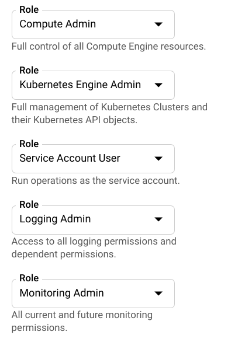

# Overview
There are a lot of articles on the internet explaining [Kubernetes](https://kubernetes.io/) already, so I will skip that part. In this blog, we will deploy a Kubernetes cluster into a Google Kubernetes Engine cluster with Terraform.

To keep the simplicity of this blog, I will skip the installation of the tools. I will use a general used folder structure for Terraform, you should make changes to suit your needs.

# What are we going go create
- Kubernetes cluster in Google Kubernetes Engine.
- Kubernetes node pool to attach into the cluster.
- A docker image to test our cluster.

# Let's get started
## 1. Install the tools
In this blog, three tools will be used.
- [gcloud](https://cloud.google.com/sdk/install): the command line interface for Google Cloud Platform.
- [terraform](https://www.terraform.io/downloads.html): an Infrastructure as Code provisioner.
- [kubectl](https://www.terraform.io/downloads.html): a command line interface to control Kubernertes. Terraform comes with Kubernetes provider. However, they have some limitations such as not having [Custom Resource Definition](https://github.com/terraform-providers/terraform-provider-kubernetes/issues/215). I would recommend learning [Helm](https://helm.sh/) myself, but using `kubectl` is sufficient for this blog.
- [golang](https://golang.org/): we are going to build a golang docker image to test our cluster.
- [docker](https://www.docker.com/): to create and push docker image

## 2. Create a GCP project
We first need to create a GCP project with CLI.

#### The project can be created with.
```
gcloud projects create kube-gke-terra --name=Kubegke
```
#### Wait for the project finish creating, then list projects.
```
$ gcloud projects list
PROJECT_ID      NAME     PROJECT_NUMBER
kube-gke-terra  Kubegke  00000000000
```
#### Enable billing for this project.
List billing accounts
```
gcloud alpha billing accounts list
```

Link billing account with this project
```
gcloud beta billing projects link kube-gke-terra --billing-account=000000-000000-000000
```
#### Enable Kubernetes API for this project
```
gcloud config set project kube-gke-terra
```
Then wait for the API to ready... Great, we have a project ready.

## 2. Deploy a Kubernetes cluster with Terraform

Let's look at the folder structure

```yaml{2}
├── files
│   └── gcp_key.json
├── main.tf
├── modules
└── variables.tf
```

Notice that we have the `gcp_key.json`, this file can be obtained by using [GCP's service account](https://cloud.google.com/iam/docs/creating-managing-service-accounts). Make sure the service account have at least the following permissions.

This is the main method we use in Terraform to authenticate the provider. In real environments, I would recommend encode the file to base64, store the file into a protected, hidden variable then use the [base64decode](https://www.terraform.io/docs/configuration/functions/base64decode.html) function of Terraform to use it, but for now let's just use the file.

```json{9,14,15}{numberLines: true}
# main.tf
terraform {
  backend "local" {
    path = "../state/terraform.tfstate"
  }
}

provider "google" {
  credentials = "${file("files/gcp_key.json")}"
  project = "${var.project_id}"
  region = "${var.region}"
}

module "kube-cluster" {
  source = "../../modules/kube-cluster"

  location = "${var.region}"
  
  # Cluster
  name = "${var.cluster_name}"
  project_id = "${var.project_id}"
  node_locations = "${var.node_locations}"

  # Node pool
  pool_name = "${var.node_pool_name}"
  node_count = "${var.node_count}"
  machine_type = "${var.machine_type}"
}
```

[Modules](https://www.terraform.io/docs/modules/index.html) in Terraform provide a little abstraction layer. We create a module to initiate a Kubernetes cluster, you can write a module for yourself to, for example, create a FileStore for Kubernetes Persistent Storage. So this is our `kube-cluster` module.

```json{6,9-11}{numberLines: true}
# modules/kube-cluster/cluster.tf
resource "google_container_cluster" "primary" {
  name = "dev-cluster"
  location = "australia-southeast1"

  remove_default_node_pool = true
  initial_node_count = 1

  provisioner "local-exec" {
    command = "gcloud container clusters get-credentials ${google_container_cluster.primary.name} --project ${var.project_id}"
  }
}
```
This will create a Kubernetes cluster on our GCP. We should remove the default node pool and attach our own node pool for easier management, shown at line 6.

Line 9-11 will configure our `kubectl` to use the cluster.

The following will be our node pool.

```json{9}{numberLines: true}
resource "google_container_node_pool" "primary_preemptible_nodes" {
  name = "${var.node_pool_name}"
  cluster = "${google_container_cluster.primary.name}"
  location = "${var.location}"

  node_count = "${var.node_count}"

  node_config {
    preemptible = true
    machine_type = "${var.machine_type}"
    metadata = {
      disable-legacy-endpoints = "true"
    }

    oauth_scopes = [
      "https://www.googleapis.com/auth/logging.write",
      "https://www.googleapis.com/auth/monitoring",
    ]
  }
}
```
We will be using [preemptible](https://cloud.google.com/kubernetes-engine/docs/how-to/preemptible-vms) nodes to reduce the cost for this blog.

The trivial codes such as variables can be found at: https://github.com/punkupoz/terra-ship

**Ok let's use Terraform.**

Move into root of directory and type `terraform init` to initialise our backend.

After that, type `terraform apply`. You should review what will be created. After finishing reviewing, type `yes` let Terraform do it's job. This will take a while because Terraform is stateful and have to wait for GCP to finish creating the cluster.

Finally, you can use the following command to see if the cluster is ready.

```
$ kubectl get nodes
NAME                                     STATUS   ROLES    AGE   VERSION
gke-dev-cluster-dev-pool-2b7d74ee-m42f   Ready    <none>   26m   v1.13.11-gke.14
gke-dev-cluster-dev-pool-44895bea-n3j9   Ready    <none>   26m   v1.13.11-gke.14
gke-dev-cluster-dev-pool-678a7e37-93qb   Ready    <none>   26m   v1.13.11-gke.14
```

Great, let's try the cluster by deploying a Hello, World!

# Try the cluster

## Prepare the image

Let's create a simple golang "Hello, world!" docker image
```go{numberLines: true}
package main

import (
	"fmt"
	"net/http"
)

func main() {
	http.HandleFunc("/", func(w http.ResponseWriter, r *http.Request) {
		_, _ = w.Write([]byte("Hello, World"))
	})

	http.HandleFunc("/healthz", func(w http.ResponseWriter, r *http.Request) {
		_, _ = w.Write([]byte("Healthy!"))
	})

	err := http.ListenAndServe(":8080", nil)
	if err != nil {
		fmt.Println(err)
	}
}
```

We build an image with this Dockerfile
```dockerfile
FROM golang:1.13-alpine as builder
WORKDIR /build
ADD main.go .
RUN go build -o app .

FROM alpine:latest

WORKDIR /

COPY --from=builder /build/app .
EXPOSE 8080

CMD ["/app"]
```

The image is available on [Dockerhub](https://hub.docker.com/repository/docker/punkupoz/go-hello-world).

## Deploy to the cluster

To keep this blog simple, we will just create a simple Deployment, with a LoadBalancer service to expose the app.

Here is our deployment.yml

```yaml
--- 
apiVersion: v1
kind: Service
metadata: 
  name: go-service
spec: 
  ports: 
    - name: http
      port: 80
      targetPort: 8080
      protocol: TCP
  selector: 
    app: go-hello-world
  type: LoadBalancer
--- 
apiVersion: apps/v1
kind: Deployment
metadata: 
  labels: 
    app: go-hello-world
  name: go-hello-world
spec: 
  replicas: 2
  selector:
    matchLabels:
      app: go-hello-world
  template: 
    metadata: 
      labels: 
        app: go-hello-world
    spec: 
      containers: 
        - image: punkupoz/go-hello-world:latest
          name: go-hello-world
          ports: 
            - containerPort: 8080
```

Run the file with `kubectl apply -f deployment.yml`

```
$ kubectl apply -f deployment.yml 
service/go-service created
deployment.apps/go-hello-world created
```

Check the deployment with `kubectl get pods` and `kubectl get deployments`
```
$ kubectl get deploy && kubectl get po
NAME             READY   UP-TO-DATE   AVAILABLE   AGE
go-hello-world   2/2     2            2           15m
NAME                              READY   STATUS    RESTARTS   AGE
go-hello-world-5564cf5f48-d4t4q   1/1     Running   0          10m
go-hello-world-5564cf5f48-n9v7v   1/1     Running   0          10m
```

You can check the service with `kubectl get svc`

```
$ kubectl get service
NAME         TYPE           CLUSTER-IP    EXTERNAL-IP   PORT(S)        AGE
go-service   LoadBalancer   10.15.248.7   <pending>     80:30906/TCP   8s
kubernetes   ClusterIP      10.15.240.1   <none>        443/TCP        42m
```

The External IP will be at pending state for a few minute. After the service has been assigned an ip, you can try accessing the ip.

```
$ curl `kubectl get svc -o json | jq -j ".items[0].status.loadBalancer.ingress[0].ip"`
Hello, World!
```

Great! We have deployed our Hello, world! app on GKE.

[Rel](/kube-gke-terraform/)
